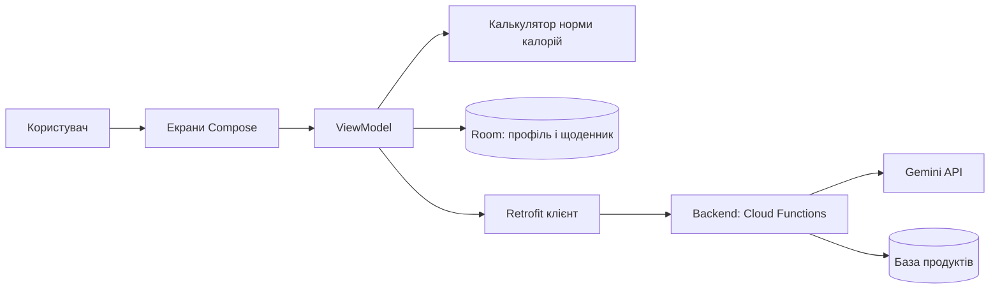
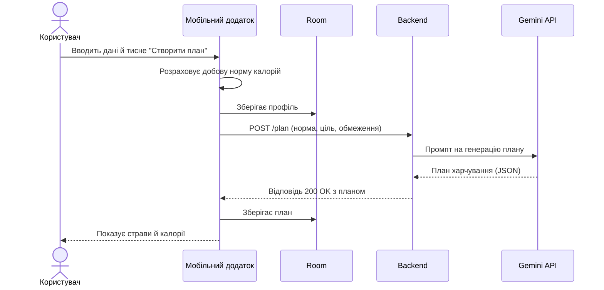

# Lab 1. Налаштування середовища та концепція мобільного додатку

**Студент:** Бабʼяк Анастасія
**Група:** ДС-44

## 1. Середовище розробки
Встановлено Android Studio, створено проєкт з шаблону Empty Activity, додаток запущено на емуляторі.

## 2. Індустрія
Дієтологія

## 3. Ідея додатку

**Назва:** Дієтокс, калькулятор калорій з AI-планом харчування.

- **Цільова аудиторія:** жінки та чоловіки віком 16-60 років.
- **Ключова проблема:** розрахунок калорій у харчуванні та складання раціону під свою норму.
- **Унікальна цінність:** розробка плану харчування відповідно до кількості калорій продуктів за допомогою підбору через ШІ.
- **Порівняння з аналогами:** FatSecret, Calorize, Calvi. У цих додатках розрахунок відбувається за фотозвітами: програма сама визначає калорійність продукту чи страви загалом, що зручно для щоденного використання. Деякі працюють із ШІ на базовому рівні: нагадування про прийом їжі, допомога з підбором продуктів для заповнення або зменшення калорій.
- **MVP-скоуп:**
  - **Входить у MVP:** введення даних користувача (вік, стать, вага, зріст, рівень активності, мета); розрахунок добової норми калорій; AI-генерація плану харчування на день; база продуктів із калорійністю та ручне додавання з'їденого; підрахунок калорій за день (з'їдено / залишилось).
  - **Не входить у MVP (відкладено на V1-V2):** розпізнавання їжі за фото; нагадування про прийом їжі; графіки прогресу та статистика за тиждень; синхронізація з фітнес-браслетами; соціальні функції та челенджі.

## 4. Архітектура

### Етапи розвитку
| Рівень | Що входить |
|---|---|
| **POC** | Форма введення даних, розрахунок добової норми калорій, один запит до AI з виведенням плану харчування текстом |
| **MVP** | Профіль користувача, AI-план харчування на день, база продуктів, щоденник з'їденого, лічильник «з'їдено / залишилось» |
| **V1** | Розпізнавання їжі за фото, нагадування про прийом їжі, графіки прогресу, план на тиждень |
| **V2** | Синхронізація з фітнес-браслетами, акаунти й хмарна синхронізація, соціальні функції, аналітика та моніторинг |

За межами курсу: V1 і V2.

### User stories для MVP
- Як користувач, я хочу ввести вік, стать, вагу, зріст і рівень активності, щоб отримати свою добову норму калорій.
- Як користувач, я хочу вибрати ціль (схуднути / утримати вагу / набрати), щоб норма відповідала моїй меті.
- Як користувач, я хочу отримати від AI план харчування на день, щоб не складати раціон самостійно.
- Як користувач, я хочу вказати продукти, які не їм (алергії, вподобання), щоб план мені підходив.
- Як користувач, я хочу додавати з'їдене в щоденник, щоб бачити, скільки калорій уже спожито.
- Як користувач, я хочу бачити, скільки калорій залишилось на день, щоб планувати наступні прийоми їжі.
- Як користувач, я хочу замінити страву в плані, щоб підібрати варіант до смаку.

### Компоненти системи
| Шар | Технологія | Обґрунтування |
|---|---|---|
| **Mobile** | Kotlin + Jetpack Compose | Сучасний стандарт Android, збігається з шаблоном проєкту |
| **Локальні дані** | Room (SQLite) | Профіль і щоденник працюють без інтернету |
| **Мережа** | Retrofit + JSON | Простий виклик backend |
| **Backend** | Firebase Cloud Functions (або FastAPI) | Мінімум коду для MVP, ключ AI не зберігається в додатку |
| **AI-шар** | Gemini API | Генерує план харчування за промптом із нормою калорій, ціллю та обмеженнями |
| **База продуктів** | Власний JSON-набір, далі відкрите API (наприклад Open Food Facts) | Для MVP достатньо невеликого локального списку |

### Діаграма компонентів

    
### Sequence-діаграма (головний сценарій: отримати план харчування)

### Потік даних
1. Користувач вводить дані в форму й тисне кнопку.
2. ViewModel перевіряє дані та розраховує норму калорій за формулою Міффліна-Сан Жеора.
3. Профіль зберігається в Room.
4. Додаток надсилає на backend HTTPS-запит POST у форматі JSON (норма, ціль, обмеження).
5. Backend формує промпт і викликає Gemini API.
6. Gemini повертає план у форматі JSON, backend перевіряє його структуру.
7. Додаток отримує відповідь, зберігає її в Room та показує на екрані.

## 5. Вимоги

### Функціональні вимоги
- FR1. Система повинна дозволяти ввести вік, стать, вагу, зріст, рівень активності та ціль.
- FR2. Система повинна розраховувати добову норму калорій за введеними даними.
- FR3. Система повинна генерувати за допомогою AI план харчування на день відповідно до норми калорій.
- FR4. Система повинна враховувати продукти-винятки (алергії, вподобання) при генерації плану.
- FR5. Система повинна показувати калорійність кожної страви й загальну суму за день.
- FR6. Система повинна дозволяти додавати продукти в щоденник вручну з бази продуктів.
- FR7. Система повинна показувати, скільки калорій з'їдено та скільки залишилось.
- FR8. Система повинна дозволяти замінити страву в плані (повторний запит до AI).
- FR9. Система повинна зберігати профіль, план і щоденник на пристрої.

### Нефункціональні вимоги
- **Продуктивність:** розрахунок норми за 1 с, генерація AI-плану не довше 10 с з індикатором завантаження.
- **Безпека:** ключ AI зберігається тільки на backend, зв'язок через HTTPS, особисті дані (вага, вік) не передаються третім особам.
- **Доступність:** достатній контраст тексту, підтримка збільшеного шрифту, зрозумілі підписи елементів.
- **Офлайн:** профіль, щоденник і збережений план доступні без інтернету; для нового плану інтернет потрібен.
- **Пристрої:** Android 8.0+ (API 26+), телефони різних розмірів екрана.
- **Безпека здоровʼя:** додаток не є медичним сервісом і показує відповідне застереження; для віку 16-17 років не пропонуються жорсткі обмеження калорій.

### Acceptance criteria (Given / When / Then)
**FR2. Розрахунок норми**
- Given користувач ввів коректні вік, вагу, зріст, стать і активність, When він натискає «Розрахувати», Then система показує добову норму калорій.
- Given у полі ваги вказано 0 або порожньо, When користувач натискає «Розрахувати», Then система показує повідомлення про помилку й не рахує.

**FR3. AI-план**
- Given норма калорій розрахована й є інтернет, When користувач натискає «Створити план», Then протягом 10 с з'являється план із прийомами їжі.
- Given сума калорій у плані відхиляється від норми більш ніж на 10%, When план отримано, Then система повторно запитує AI або попереджає користувача.
- Given інтернету немає, When користувач натискає «Створити план», Then система показує повідомлення про відсутність мережі й пропонує спробувати пізніше.

**FR6-FR7. Щоденник**
- Given відкритий щоденник, When користувач додає продукт із вагою, Then калорії додаються до «з'їдено» й зменшують «залишилось».
- Given спожито більше за норму, When калорії оновились, Then «залишилось» показує перевищення (наприклад, червоним кольором).

**FR8. Заміна страви**
- Given відкритий план, When користувач натискає «Замінити» біля страви, Then з'являється нова страва з близькою калорійністю.

### Пріоритезація (MoSCoW)
| Категорія | Вимоги |
|---|---|
| **Must have** | FR1, FR2, FR3, FR5, FR7, FR9, безпека ключа AI |
| **Should have** | FR4, FR6, FR8, обробка помилок мережі |
| **Could have** | Темна тема, підтримка кількох мов, експорт плану |
| **Won't have (у MVP)** | Розпізнавання за фото, нагадування, графіки, синхронізація з браслетами, соціальні функції |

### Edge cases
**Враховуємо в MVP:**
- некоректні або порожні дані (від'ємна вага, вік поза 16-60);
- відсутність інтернету або таймаут AI;
- AI повернув відповідь у неправильному форматі;
- сума калорій у плані сильно відрізняється від норми;
- користувач вказав так багато винятків, що план неможливо скласти;
- норма виходить за безпечні межі (дуже низька чи висока).

**Відкладаємо:**
- кілька користувачів на одному пристрої;
- зміна одиниць (фунти, дюйми);
- конфлікти синхронізації між пристроями;
- обробка рідкісних дієт (веганство, кето, медичні дієти).
## 6. Використання AI
Для генерації ідей, архітектури та вимог використано Gemini (gemini.google.com). Основні промпти: пошук унікальної цінності й порівняння з аналогами, визначення MVP-скоупу, генерація user stories, Mermaid-діаграм, функціональних і нефункціональних вимог, acceptance criteria та MoSCoW.