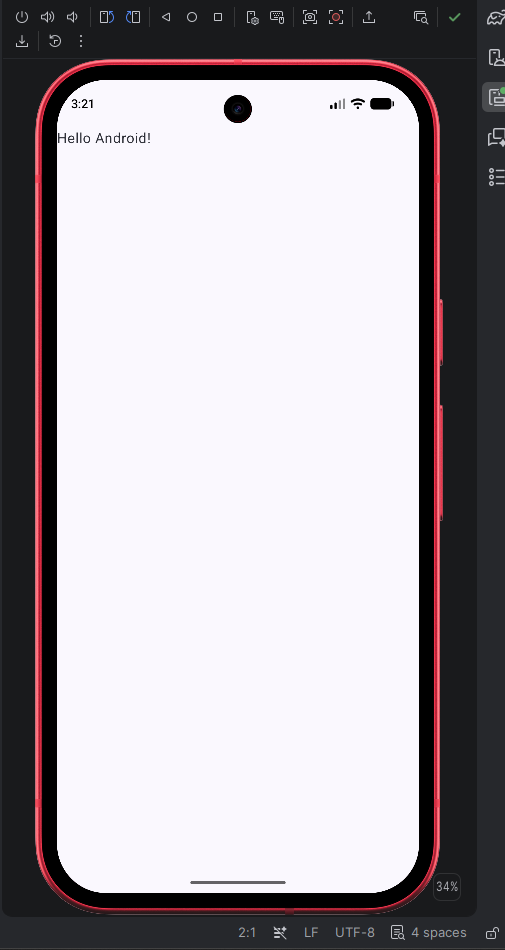

# Lab 1. Налаштування середовища та концепція мобільного додатку

**Студент:** [Прізвище Ім'я]
**Група:** [група]

## 1. Середовище розробки
Встановлено Android Studio, створено проєкт з шаблону Empty Activity, додаток запущено на емуляторі.



## 2. Індустрія
[Обрана індустрія]

## 3. Ідея додатку
[Назва і короткий опис ідеї]

- **Цільова аудиторія:** [...]
- **Ключова проблема:** [...]
- **Унікальна цінність:** [...]
- **Порівняння з аналогами:** [3 аналоги, сильні й слабкі сторони]
- **MVP-скоуп:** [що входить, що ні]

## 4. Архітектура
### Етапи розвитку (POC → MVP → V1 → V2)
[...]

### User stories для MVP
[...]

### Компоненти (mobile + backend + AI)
[...]

### Діаграма компонентів
```mermaid
[вставити код діаграми з Gemini]
```

### Sequence-діаграма
```mermaid
[вставити код діаграми з Gemini]
```

## 5. Вимоги
### Функціональні
[...]

### Нефункціональні
[...]

### Acceptance criteria (Given / When / Then)
[...]

### Пріоритизація (MoSCoW)
[...]

### Edge cases
[...]

## 6. Використання AI
Для генерації ідей, архітектури та вимог використано Gemini (gemini.google.com).